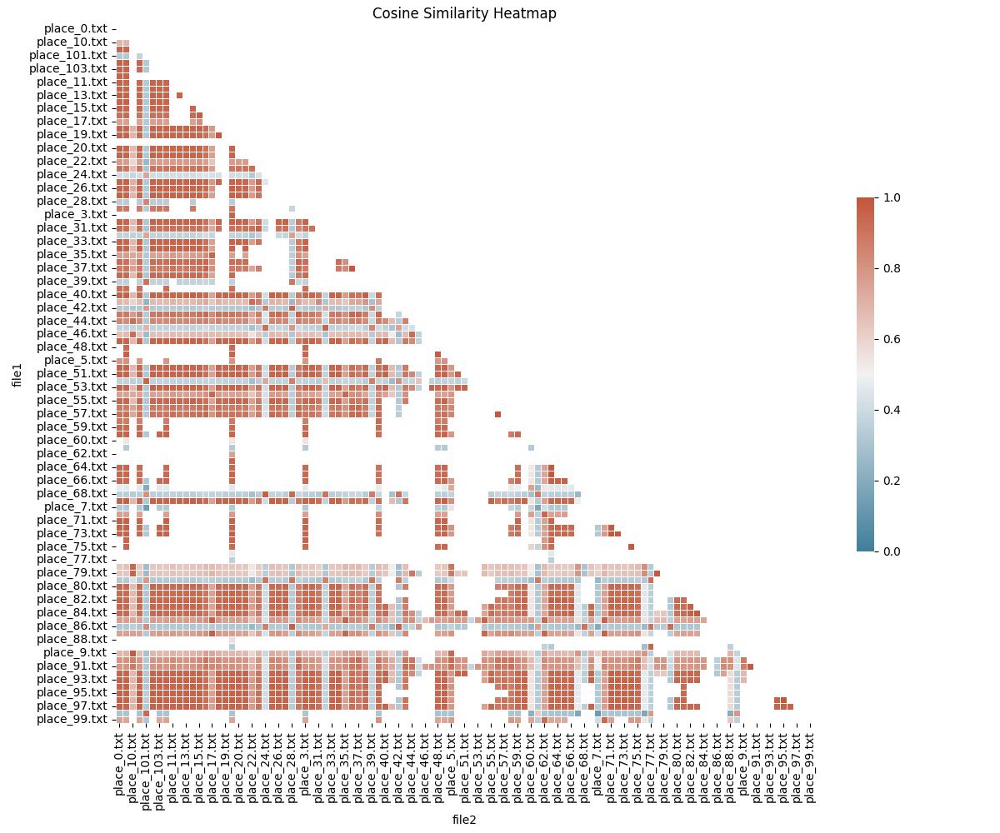

# Document Similarity Analysis Report
Generated on: 2025-03-05 17:12:35

## Overview
This report compares three different similarity metrics for document comparison:
- **Jaccard Similarity**: Measures the overlap between word sets
- **Cosine Similarity**: Measures the angular similarity between TF-IDF vector representations
- **Edit Distance Similarity**: Measures the character-level editing operations required to transform one text into another

## Data Files Used
- Input files: [/Users/jfulch/git/school/haunted_places_tika_analysis/haunted_places_files](file:///Users/jfulch/git/school/haunted_places_tika_analysis/haunted_places_files)
- Similarity results:
  - [Jaccard Similarity CSV](jaccard_similarity_sample5pct_max1000files.csv)
  - [Cosine Similarity CSV](cosine_similarity_sample5pct_max1000files.csv)
  - [Edit Distance Similarity CSV](edit_similarity_sample5pct_max1000files.csv)

## Similarity Metrics Summary

### Jaccard Similarity
- Based on token overlap (word sets)
- Range: 0 (no overlap) to 1 (identical sets)
- Ignores word frequency and order
- Best for: Comparing document vocabulary regardless of structure

### Cosine Similarity 
- Based on TF-IDF vector representation
- Range: 0 (completely different) to 1 (identical direction)
- Considers term frequency and importance
- Best for: Topic-based similarity and content comparison

### Edit Distance Similarity
- Based on character-level Levenshtein distance
- Range: 0 (completely different) to 1 (identical texts)
- Sensitive to spelling, structure, and word order
- Best for: Detecting small edits and structural similarities

## Similarity Distributions

### Jaccard Similarity Distribution

### Cosine Similarity Distribution

### Edit Distance Similarity Distribution

## Document Similarity Maps

These visualizations show documents positioned in 2D space based on their similarity. 
Documents that are similar to each other appear closer together.

### Jaccard Similarity Map

### Cosine Similarity Map

### Edit Distance Similarity Map

## Similarity Heatmaps

These heatmaps visualize the similarity between each pair of documents. 
Darker colors indicate higher similarity.

### Jaccard Similarity Heatmap

### Cosine Similarity Heatmap

### Edit Distance Similarity Heatmap

## Analysis Results

### Jaccard Similarity Statistics
- **Average similarity**: 0.2518
- **Median similarity**: 0.2500
- **Minimum similarity**: 0.0850
- **Maximum similarity**: 0.5167

### Cosine Similarity Statistics
- **Average similarity**: 0.0901
- **Median similarity**: 0.0827
- **Minimum similarity**: 0.0156
- **Maximum similarity**: 0.4325

### Edit Distance Similarity Statistics
- **Average similarity**: 0.3620
- **Median similarity**: 0.3650
- **Minimum similarity**: 0.2200
- **Maximum similarity**: 0.6450

## Notable Document Comparisons

### Jaccard Similarity
- **Most similar pair**: [`Midway_Recreation_Center.txt`](file:///Users/jfulch/git/school/haunted_places_tika_analysis/haunted_places_files/Midway_Recreation_Center.txt) and [`town_circle.txt`](file:///Users/jfulch/git/school/haunted_places_tika_analysis/haunted_places_files/town_circle.txt) (similarity: 0.5167)
- **Least similar pair**: [`Army_Ammunition_Plant.txt`](file:///Users/jfulch/git/school/haunted_places_tika_analysis/haunted_places_files/Army_Ammunition_Plant.txt) and [`Sprague_Mansion.txt`](file:///Users/jfulch/git/school/haunted_places_tika_analysis/haunted_places_files/Sprague_Mansion.txt) (similarity: 0.0850)

### Cosine Similarity
- **Most similar pair**: [`Standard_Middle_School.txt`](file:///Users/jfulch/git/school/haunted_places_tika_analysis/haunted_places_files/Standard_Middle_School.txt) and [`The_Padre_Hotel.txt`](file:///Users/jfulch/git/school/haunted_places_tika_analysis/haunted_places_files/The_Padre_Hotel.txt) (similarity: 0.4325)
- **Least similar pair**: [`Arbys.txt`](file:///Users/jfulch/git/school/haunted_places_tika_analysis/haunted_places_files/Arbys.txt) and [`Paschal_Aldich_Home.txt`](file:///Users/jfulch/git/school/haunted_places_tika_analysis/haunted_places_files/Paschal_Aldich_Home.txt) (similarity: 0.0156)

### Edit Distance Similarity
- **Most similar pair**: [`Sprague_Mansion.txt`](file:///Users/jfulch/git/school/haunted_places_tika_analysis/haunted_places_files/Sprague_Mansion.txt) and [`American_River_Inn.txt`](file:///Users/jfulch/git/school/haunted_places_tika_analysis/haunted_places_files/American_River_Inn.txt) (similarity: 0.6450)
- **Least similar pair**: [`town_circle.txt`](file:///Users/jfulch/git/school/haunted_places_tika_analysis/haunted_places_files/town_circle.txt) and [`The_Reservation.txt`](file:///Users/jfulch/git/school/haunted_places_tika_analysis/haunted_places_files/The_Reservation.txt) (similarity: 0.2200)

## Cross-Metric Comparison

### Correlation Between Metrics
|               | Jaccard | Cosine | Edit Distance |
|---------------|---------|--------|--------------|
| Jaccard       | 1.000   | 0.9364 | 0.9357 |
| Cosine        | 0.9364 | 1.000   | 0.9676 |
| Edit Distance | 0.9357 | 0.9676 | 1.000   |

### Largest Discrepancies Between Metrics

#### Jaccard vs. Cosine
- [`Magnolias_Vineyard_Restaurant.txt`](file:///Users/jfulch/git/school/haunted_places_tika_analysis/haunted_places_files/Magnolias_Vineyard_Restaurant.txt) and [`Colburn_Cemetery.txt`](file:///Users/jfulch/git/school/haunted_places_tika_analysis/haunted_places_files/Colburn_Cemetery.txt): Jaccard=0.4730, Cosine=0.0948, Difference=0.3782
- [`Don_Cesar_Resort.txt`](file:///Users/jfulch/git/school/haunted_places_tika_analysis/haunted_places_files/Don_Cesar_Resort.txt) and [`Mulga.txt`](file:///Users/jfulch/git/school/haunted_places_tika_analysis/haunted_places_files/Mulga.txt): Jaccard=0.4286, Cosine=0.0519, Difference=0.3767
- [`Loop_ISD.txt`](file:///Users/jfulch/git/school/haunted_places_tika_analysis/haunted_places_files/Loop_ISD.txt) and [`OHanlon_house.txt`](file:///Users/jfulch/git/school/haunted_places_tika_analysis/haunted_places_files/OHanlon_house.txt): Jaccard=0.4430, Cosine=0.0745, Difference=0.3685

#### Jaccard vs. Edit Distance
- [`Radisson_Prince_Charles_Hotel.txt`](file:///Users/jfulch/git/school/haunted_places_tika_analysis/haunted_places_files/Radisson_Prince_Charles_Hotel.txt) and [`Joes_Cave.txt`](file:///Users/jfulch/git/school/haunted_places_tika_analysis/haunted_places_files/Joes_Cave.txt): Jaccard=0.1362, Edit=0.4450, Difference=0.3088
- [`Riverdale_Road.txt`](file:///Users/jfulch/git/school/haunted_places_tika_analysis/haunted_places_files/Riverdale_Road.txt) and [`Dragonback_Woods.txt`](file:///Users/jfulch/git/school/haunted_places_tika_analysis/haunted_places_files/Dragonback_Woods.txt): Jaccard=0.1118, Edit=0.4100, Difference=0.2982
- [`Cheyenne_Canyon.txt`](file:///Users/jfulch/git/school/haunted_places_tika_analysis/haunted_places_files/Cheyenne_Canyon.txt) and [`University_of_Central_Missouri.txt`](file:///Users/jfulch/git/school/haunted_places_tika_analysis/haunted_places_files/University_of_Central_Missouri.txt): Jaccard=0.1174, Edit=0.4150, Difference=0.2976

#### Cosine vs. Edit Distance
- [`Salem_Jail.txt`](file:///Users/jfulch/git/school/haunted_places_tika_analysis/haunted_places_files/Salem_Jail.txt) and [`OHanlon_house.txt`](file:///Users/jfulch/git/school/haunted_places_tika_analysis/haunted_places_files/OHanlon_house.txt): Cosine=0.0607, Edit=0.5550, Difference=0.4943
- [`Brantly_House.txt`](file:///Users/jfulch/git/school/haunted_places_tika_analysis/haunted_places_files/Brantly_House.txt) and [`Sprague_Mansion.txt`](file:///Users/jfulch/git/school/haunted_places_tika_analysis/haunted_places_files/Sprague_Mansion.txt): Cosine=0.0658, Edit=0.5600, Difference=0.4942
- [`Sprague_Mansion.txt`](file:///Users/jfulch/git/school/haunted_places_tika_analysis/haunted_places_files/Sprague_Mansion.txt) and [`American_River_Inn.txt`](file:///Users/jfulch/git/school/haunted_places_tika_analysis/haunted_places_files/American_River_Inn.txt): Cosine=0.1543, Edit=0.6450, Difference=0.4907

## Conclusions

### Key Observations
1. **Jaccard Similarity** focuses on shared vocabulary without considering word frequency or position.
   - Documents with similar word sets but different contexts may appear similar.

2. **Cosine Similarity** considers term frequencies and importance.
   - Better at identifying topical similarity regardless of text length.
   - Less influenced by common words that appear in many documents.

3. **Edit Distance Similarity** is sensitive to the sequence and position of text.
   - Identifies documents with similar structure and phrasing.
   - Can detect small edits and variations in text.

### Which Metric to Choose?
- **For topic similarity**: Cosine similarity is generally the best choice.
- **For structural similarity**: Edit distance is more appropriate.
- **For vocabulary overlap**: Jaccard similarity works well.

The choice of similarity metric should depend on the specific requirements of your analysis.

## Additional Resources
- [Understanding Jaccard Similarity](https://en.wikipedia.org/wiki/Jaccard_index)
- [Understanding Cosine Similarity](https://en.wikipedia.org/wiki/Cosine_similarity)
- [Understanding Edit Distance](https://en.wikipedia.org/wiki/Levenshtein_distance)
- [Multidimensional Scaling Explained](https://en.wikipedia.org/wiki/Multidimensional_scaling)
