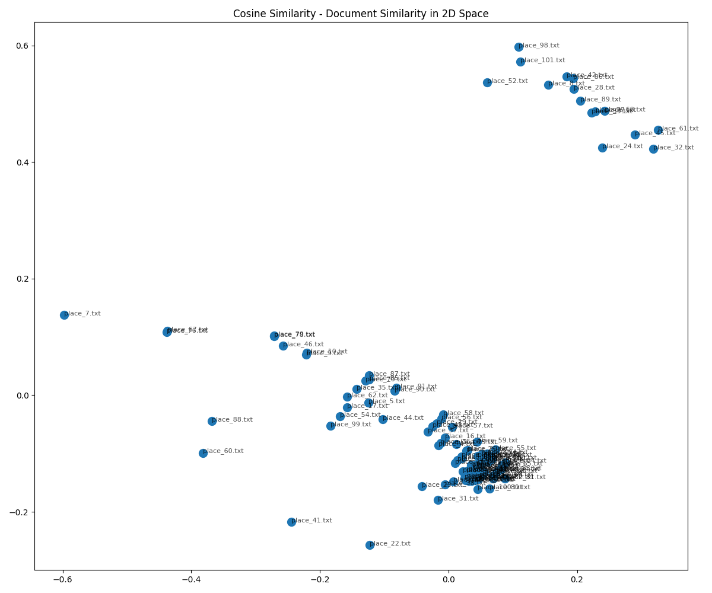
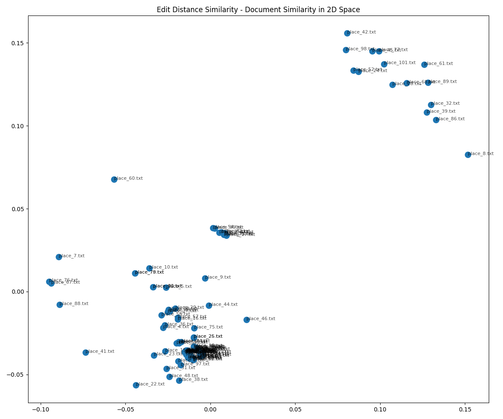

# Document Similarity Analysis Report
Generated on: 2025-03-05 14:42:35

## Overview
This report compares three different similarity metrics for document comparison:
- **Jaccard Similarity**: Measures the overlap between word sets
- **Cosine Similarity**: Measures the angular similarity between TF-IDF vector representations
- **Edit Distance Similarity**: Measures the character-level editing operations required to transform one text into another

## Data Files Used
- Input files: [/Users/jfulch/git/school/haunted_places_tika_analysis/haunted_places_files](file:///Users/jfulch/git/school/haunted_places_tika_analysis/haunted_places_files)
- Similarity results:
  - [Jaccard Similarity CSV](jaccard_similarity.csv)
  - [Cosine Similarity CSV](cosine_similarity.csv)
  - [Edit Distance Similarity CSV](edit_similarity.csv)

## Similarity Metrics Summary

### Jaccard Similarity
- Based on token overlap (word sets)
- Range: 0 (no overlap) to 1 (identical sets)
- Ignores word frequency and order
- Best for: Comparing document vocabulary regardless of structure

### Cosine Similarity 
- Based on TF-IDF vector representation
- Range: 0 (completely different) to 1 (identical direction)
- Considers term frequency and importance
- Best for: Topic-based similarity and content comparison

### Edit Distance Similarity
- Based on character-level Levenshtein distance
- Range: 0 (completely different) to 1 (identical texts)
- Sensitive to spelling, structure, and word order
- Best for: Detecting small edits and structural similarities

## Similarity Distributions

### Jaccard Similarity Distribution

### Cosine Similarity Distribution

### Edit Distance Similarity Distribution

## Document Similarity Maps

These visualizations show documents positioned in 2D space based on their similarity. 
Documents that are similar to each other appear closer together.

### Jaccard Similarity Map

### Cosine Similarity Map

### Edit Distance Similarity Map

## Similarity Heatmaps

These heatmaps visualize the similarity between each pair of documents. 
Darker colors indicate higher similarity.

### Jaccard Similarity Heatmap

### Cosine Similarity Heatmap

### Edit Distance Similarity Heatmap

## Analysis Results

### Jaccard Similarity Statistics
- **Average similarity**: 0.4990
- **Median similarity**: 0.5000
- **Minimum similarity**: 0.2381
- **Maximum similarity**: 0.9130

### Cosine Similarity Statistics
- **Average similarity**: 0.1270
- **Median similarity**: 0.1172
- **Minimum similarity**: 0.0280
- **Maximum similarity**: 0.8695

### Edit Distance Similarity Statistics
- **Average similarity**: 0.7041
- **Median similarity**: 0.6202
- **Minimum similarity**: 0.3893
- **Maximum similarity**: 0.9922

## Notable Document Comparisons

### Jaccard Similarity
- **Most similar pair**: [`place_157.txt`](file:///Users/jfulch/git/school/haunted_places_tika_analysis/haunted_places_files/place_157.txt) and [`place_107.txt`](file:///Users/jfulch/git/school/haunted_places_tika_analysis/haunted_places_files/place_107.txt) (similarity: 0.9130)
- **Least similar pair**: [`place_168.txt`](file:///Users/jfulch/git/school/haunted_places_tika_analysis/haunted_places_files/place_168.txt) and [`place_234.txt`](file:///Users/jfulch/git/school/haunted_places_tika_analysis/haunted_places_files/place_234.txt) (similarity: 0.2381)

### Cosine Similarity
- **Most similar pair**: [`place_55.txt`](file:///Users/jfulch/git/school/haunted_places_tika_analysis/haunted_places_files/place_55.txt) and [`place_57.txt`](file:///Users/jfulch/git/school/haunted_places_tika_analysis/haunted_places_files/place_57.txt) (similarity: 0.8695)
- **Least similar pair**: [`place_165.txt`](file:///Users/jfulch/git/school/haunted_places_tika_analysis/haunted_places_files/place_165.txt) and [`place_110.txt`](file:///Users/jfulch/git/school/haunted_places_tika_analysis/haunted_places_files/place_110.txt) (similarity: 0.0280)

### Edit Distance Similarity
- **Most similar pair**: [`place_185.txt`](file:///Users/jfulch/git/school/haunted_places_tika_analysis/haunted_places_files/place_185.txt) and [`place_186.txt`](file:///Users/jfulch/git/school/haunted_places_tika_analysis/haunted_places_files/place_186.txt) (similarity: 0.9922)
- **Least similar pair**: [`place_232.txt`](file:///Users/jfulch/git/school/haunted_places_tika_analysis/haunted_places_files/place_232.txt) and [`place_261.txt`](file:///Users/jfulch/git/school/haunted_places_tika_analysis/haunted_places_files/place_261.txt) (similarity: 0.3893)

## Cross-Metric Comparison

### Correlation Between Metrics
|               | Jaccard | Cosine | Edit Distance |
|---------------|---------|--------|--------------|
| Jaccard       | 1.000   | 0.7814 | 0.7932 |
| Cosine        | 0.7814 | 1.000   | 0.5157 |
| Edit Distance | 0.7932 | 0.5157 | 1.000   |

### Largest Discrepancies Between Metrics

#### Jaccard vs. Cosine
- [`place_156.txt`](file:///Users/jfulch/git/school/haunted_places_tika_analysis/haunted_places_files/place_156.txt) and [`place_158.txt`](file:///Users/jfulch/git/school/haunted_places_tika_analysis/haunted_places_files/place_158.txt): Jaccard=0.7600, Cosine=0.1672, Difference=0.5928
- [`place_156.txt`](file:///Users/jfulch/git/school/haunted_places_tika_analysis/haunted_places_files/place_156.txt) and [`place_64.txt`](file:///Users/jfulch/git/school/haunted_places_tika_analysis/haunted_places_files/place_64.txt): Jaccard=0.7600, Cosine=0.1672, Difference=0.5928
- [`place_157.txt`](file:///Users/jfulch/git/school/haunted_places_tika_analysis/haunted_places_files/place_157.txt) and [`place_156.txt`](file:///Users/jfulch/git/school/haunted_places_tika_analysis/haunted_places_files/place_156.txt): Jaccard=0.7600, Cosine=0.1694, Difference=0.5906

#### Jaccard vs. Edit Distance
- [`place_175.txt`](file:///Users/jfulch/git/school/haunted_places_tika_analysis/haunted_places_files/place_175.txt) and [`place_217.txt`](file:///Users/jfulch/git/school/haunted_places_tika_analysis/haunted_places_files/place_217.txt): Jaccard=0.4667, Edit=0.9290, Difference=0.4624
- [`place_30.txt`](file:///Users/jfulch/git/school/haunted_places_tika_analysis/haunted_places_files/place_30.txt) and [`place_190.txt`](file:///Users/jfulch/git/school/haunted_places_tika_analysis/haunted_places_files/place_190.txt): Jaccard=0.4667, Edit=0.9274, Difference=0.4607
- [`place_250.txt`](file:///Users/jfulch/git/school/haunted_places_tika_analysis/haunted_places_files/place_250.txt) and [`place_175.txt`](file:///Users/jfulch/git/school/haunted_places_tika_analysis/haunted_places_files/place_175.txt): Jaccard=0.4773, Edit=0.9353, Difference=0.4581

#### Cosine vs. Edit Distance
- [`place_159.txt`](file:///Users/jfulch/git/school/haunted_places_tika_analysis/haunted_places_files/place_159.txt) and [`place_88.txt`](file:///Users/jfulch/git/school/haunted_places_tika_analysis/haunted_places_files/place_88.txt): Cosine=0.1155, Edit=0.9548, Difference=0.8393
- [`place_62.txt`](file:///Users/jfulch/git/school/haunted_places_tika_analysis/haunted_places_files/place_62.txt) and [`place_88.txt`](file:///Users/jfulch/git/school/haunted_places_tika_analysis/haunted_places_files/place_88.txt): Cosine=0.1155, Edit=0.9514, Difference=0.8359
- [`place_293.txt`](file:///Users/jfulch/git/school/haunted_places_tika_analysis/haunted_places_files/place_293.txt) and [`place_263.txt`](file:///Users/jfulch/git/school/haunted_places_tika_analysis/haunted_places_files/place_263.txt): Cosine=0.1159, Edit=0.9513, Difference=0.8354

## Conclusions

### Key Observations
1. **Jaccard Similarity** focuses on shared vocabulary without considering word frequency or position.
   - Documents with similar word sets but different contexts may appear similar.

2. **Cosine Similarity** considers term frequencies and importance.
   - Better at identifying topical similarity regardless of text length.
   - Less influenced by common words that appear in many documents.

3. **Edit Distance Similarity** is sensitive to the sequence and position of text.
   - Identifies documents with similar structure and phrasing.
   - Can detect small edits and variations in text.

### Which Metric to Choose?
- **For topic similarity**: Cosine similarity is generally the best choice.
- **For structural similarity**: Edit distance is more appropriate.
- **For vocabulary overlap**: Jaccard similarity works well.

The choice of similarity metric should depend on the specific requirements of your analysis.

## Additional Resources
- [Understanding Jaccard Similarity](https://en.wikipedia.org/wiki/Jaccard_index)
- [Understanding Cosine Similarity](https://en.wikipedia.org/wiki/Cosine_similarity)
- [Understanding Edit Distance](https://en.wikipedia.org/wiki/Levenshtein_distance)
- [Multidimensional Scaling Explained](https://en.wikipedia.org/wiki/Multidimensional_scaling)
