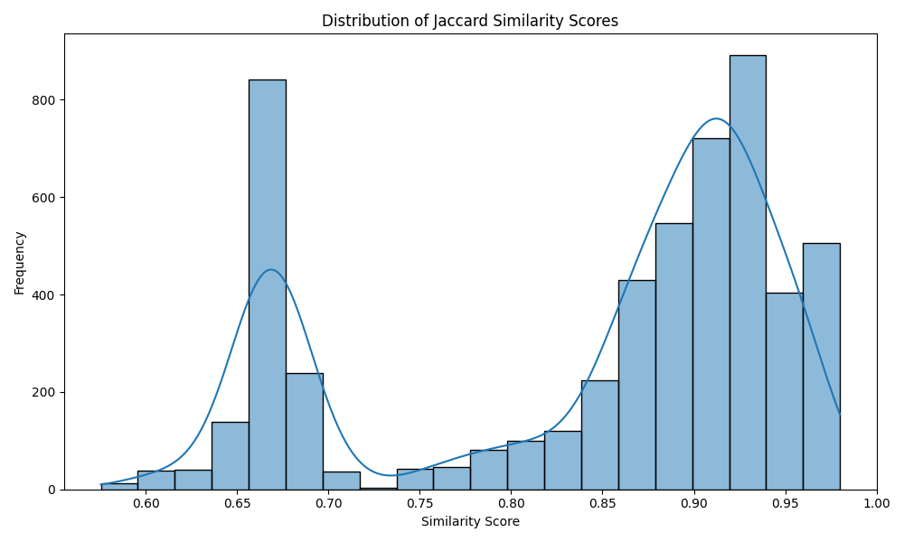
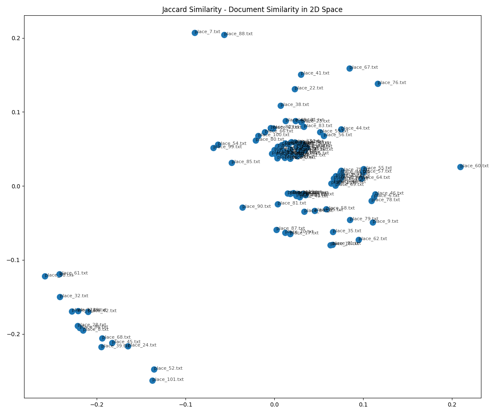
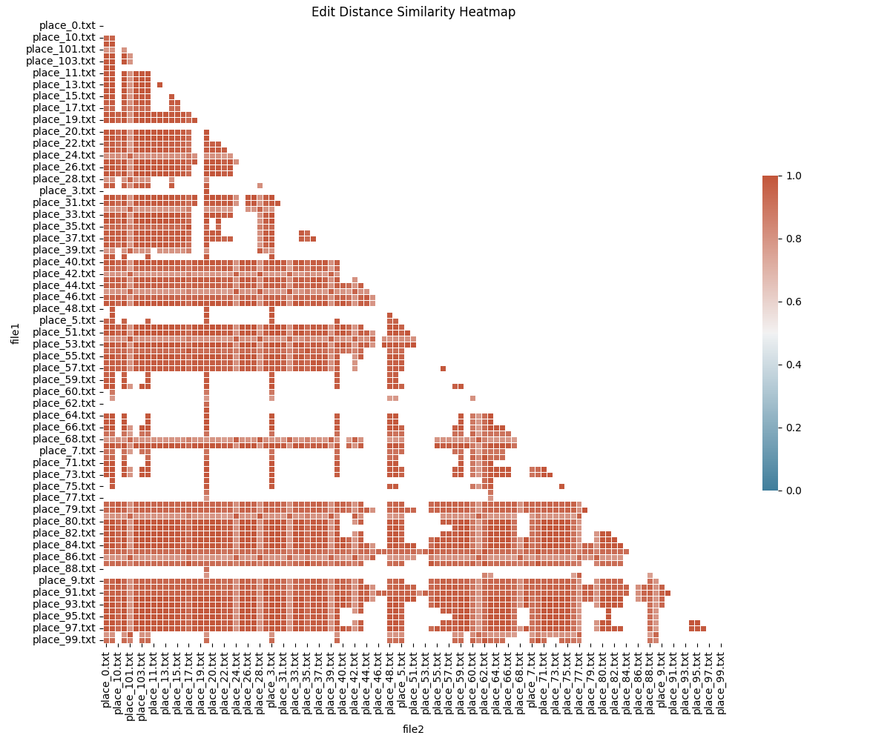

# Document Similarity Analysis Report
Generated on: 2025-03-06 13:42:13

## Overview
This report compares three different similarity metrics for document comparison:
- **Jaccard Similarity**: Measures the overlap between word sets
- **Cosine Similarity**: Measures the angular similarity between TF-IDF vector representations
- **Edit Distance Similarity**: Measures the character-level editing operations required to transform one text into another

## Data Files Used
- Input files: [/Users/jfulch/git/school/haunted_places_tika_analysis/haunted_places_files](file:///Users/jfulch/git/school/haunted_places_tika_analysis/haunted_places_files)
- Similarity results:
  - [Jaccard Similarity CSV](jaccard_similarity.csv)
  - [Cosine Similarity CSV](cosine_similarity.csv)
  - [Edit Distance Similarity CSV](edit_similarity.csv)

## Similarity Metrics Summary

### Jaccard Similarity
- Based on token overlap (word sets)
- Range: 0 (no overlap) to 1 (identical sets)
- Ignores word frequency and order
- Best for: Comparing document vocabulary regardless of structure

### Cosine Similarity 
- Based on TF-IDF vector representation
- Range: 0 (completely different) to 1 (identical direction)
- Considers term frequency and importance
- Best for: Topic-based similarity and content comparison

### Edit Distance Similarity
- Based on character-level Levenshtein distance
- Range: 0 (completely different) to 1 (identical texts)
- Sensitive to spelling, structure, and word order
- Best for: Detecting small edits and structural similarities

## Similarity Distributions

### Jaccard Similarity Distribution

### Cosine Similarity Distribution

### Edit Distance Similarity Distribution

## Document Similarity Maps

These visualizations show documents positioned in 2D space based on their similarity. 
Documents that are similar to each other appear closer together.

### Jaccard Similarity Map

### Cosine Similarity Map

### Edit Distance Similarity Map

## Similarity Heatmaps

These heatmaps visualize the similarity between each pair of documents. 
Darker colors indicate higher similarity.

### Jaccard Similarity Heatmap

### Cosine Similarity Heatmap

### Edit Distance Similarity Heatmap

## Analysis Results

### Jaccard Similarity Statistics
- **Average similarity**: 0.7145
- **Median similarity**: 0.7115
- **Minimum similarity**: 0.5278
- **Maximum similarity**: 0.9535

### Cosine Similarity Statistics
- **Average similarity**: 0.2087
- **Median similarity**: 0.2036
- **Minimum similarity**: 0.0622
- **Maximum similarity**: 0.8966

### Edit Distance Similarity Statistics
- **Average similarity**: 0.9136
- **Median similarity**: 0.9375
- **Minimum similarity**: 0.7547
- **Maximum similarity**: 0.9966

## Notable Document Comparisons

### Jaccard Similarity
- **Most similar pair**: [`place_223.txt`](file:///Users/jfulch/git/school/haunted_places_tika_analysis/haunted_places_files/place_223.txt) and [`place_226.txt`](file:///Users/jfulch/git/school/haunted_places_tika_analysis/haunted_places_files/place_226.txt) (similarity: 0.9535)
- **Least similar pair**: [`place_287.txt`](file:///Users/jfulch/git/school/haunted_places_tika_analysis/haunted_places_files/place_287.txt) and [`place_168.txt`](file:///Users/jfulch/git/school/haunted_places_tika_analysis/haunted_places_files/place_168.txt) (similarity: 0.5278)

### Cosine Similarity
- **Most similar pair**: [`place_55.txt`](file:///Users/jfulch/git/school/haunted_places_tika_analysis/haunted_places_files/place_55.txt) and [`place_57.txt`](file:///Users/jfulch/git/school/haunted_places_tika_analysis/haunted_places_files/place_57.txt) (similarity: 0.8966)
- **Least similar pair**: [`place_125.txt`](file:///Users/jfulch/git/school/haunted_places_tika_analysis/haunted_places_files/place_125.txt) and [`place_261.txt`](file:///Users/jfulch/git/school/haunted_places_tika_analysis/haunted_places_files/place_261.txt) (similarity: 0.0622)

### Edit Distance Similarity
- **Most similar pair**: [`place_185.txt`](file:///Users/jfulch/git/school/haunted_places_tika_analysis/haunted_places_files/place_185.txt) and [`place_186.txt`](file:///Users/jfulch/git/school/haunted_places_tika_analysis/haunted_places_files/place_186.txt) (similarity: 0.9966)
- **Least similar pair**: [`place_198.txt`](file:///Users/jfulch/git/school/haunted_places_tika_analysis/haunted_places_files/place_198.txt) and [`place_165.txt`](file:///Users/jfulch/git/school/haunted_places_tika_analysis/haunted_places_files/place_165.txt) (similarity: 0.7547)

## Cross-Metric Comparison

### Correlation Between Metrics
|               | Jaccard | Cosine | Edit Distance |
|---------------|---------|--------|--------------|
| Jaccard       | 1.000   | 0.8839 | 0.6830 |
| Cosine        | 0.8839 | 1.000   | 0.5506 |
| Edit Distance | 0.6830 | 0.5506 | 1.000   |

### Largest Discrepancies Between Metrics

#### Jaccard vs. Cosine
- [`place_135.txt`](file:///Users/jfulch/git/school/haunted_places_tika_analysis/haunted_places_files/place_135.txt) and [`place_35.txt`](file:///Users/jfulch/git/school/haunted_places_tika_analysis/haunted_places_files/place_35.txt): Jaccard=0.7358, Cosine=0.1426, Difference=0.5932
- [`place_35.txt`](file:///Users/jfulch/git/school/haunted_places_tika_analysis/haunted_places_files/place_35.txt) and [`place_38.txt`](file:///Users/jfulch/git/school/haunted_places_tika_analysis/haunted_places_files/place_38.txt): Jaccard=0.7358, Cosine=0.1430, Difference=0.5929
- [`place_253.txt`](file:///Users/jfulch/git/school/haunted_places_tika_analysis/haunted_places_files/place_253.txt) and [`place_151.txt`](file:///Users/jfulch/git/school/haunted_places_tika_analysis/haunted_places_files/place_151.txt): Jaccard=0.7273, Cosine=0.1356, Difference=0.5917

#### Jaccard vs. Edit Distance
- [`place_175.txt`](file:///Users/jfulch/git/school/haunted_places_tika_analysis/haunted_places_files/place_175.txt) and [`place_217.txt`](file:///Users/jfulch/git/school/haunted_places_tika_analysis/haunted_places_files/place_217.txt): Jaccard=0.6000, Edit=0.9537, Difference=0.3537
- [`place_30.txt`](file:///Users/jfulch/git/school/haunted_places_tika_analysis/haunted_places_files/place_30.txt) and [`place_190.txt`](file:///Users/jfulch/git/school/haunted_places_tika_analysis/haunted_places_files/place_190.txt): Jaccard=0.6000, Edit=0.9526, Difference=0.3526
- [`place_96.txt`](file:///Users/jfulch/git/school/haunted_places_tika_analysis/haunted_places_files/place_96.txt) and [`place_30.txt`](file:///Users/jfulch/git/school/haunted_places_tika_analysis/haunted_places_files/place_30.txt): Jaccard=0.6000, Edit=0.9504, Difference=0.3504

#### Cosine vs. Edit Distance
- [`place_159.txt`](file:///Users/jfulch/git/school/haunted_places_tika_analysis/haunted_places_files/place_159.txt) and [`place_88.txt`](file:///Users/jfulch/git/school/haunted_places_tika_analysis/haunted_places_files/place_88.txt): Cosine=0.1266, Edit=0.9707, Difference=0.8440
- [`place_129.txt`](file:///Users/jfulch/git/school/haunted_places_tika_analysis/haunted_places_files/place_129.txt) and [`place_110.txt`](file:///Users/jfulch/git/school/haunted_places_tika_analysis/haunted_places_files/place_110.txt): Cosine=0.1204, Edit=0.9643, Difference=0.8439
- [`place_196.txt`](file:///Users/jfulch/git/school/haunted_places_tika_analysis/haunted_places_files/place_196.txt) and [`place_110.txt`](file:///Users/jfulch/git/school/haunted_places_tika_analysis/haunted_places_files/place_110.txt): Cosine=0.1206, Edit=0.9632, Difference=0.8426

## Conclusions

### Key Observations
1. **Jaccard Similarity** focuses on shared vocabulary without considering word frequency or position.
   - Documents with similar word sets but different contexts may appear similar.

2. **Cosine Similarity** considers term frequencies and importance.
   - Better at identifying topical similarity regardless of text length.
   - Less influenced by common words that appear in many documents.

3. **Edit Distance Similarity** is sensitive to the sequence and position of text.
   - Identifies documents with similar structure and phrasing.
   - Can detect small edits and variations in text.

### Which Metric to Choose?
- **For topic similarity**: Cosine similarity is generally the best choice.
- **For structural similarity**: Edit distance is more appropriate.
- **For vocabulary overlap**: Jaccard similarity works well.

The choice of similarity metric should depend on the specific requirements of your analysis.

## Additional Resources
- [Understanding Jaccard Similarity](https://en.wikipedia.org/wiki/Jaccard_index)
- [Understanding Cosine Similarity](https://en.wikipedia.org/wiki/Cosine_similarity)
- [Understanding Edit Distance](https://en.wikipedia.org/wiki/Levenshtein_distance)
- [Multidimensional Scaling Explained](https://en.wikipedia.org/wiki/Multidimensional_scaling)
